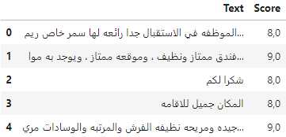

# DL-Atelier3

This lab aims to provide an introduction to PyTorch and build deep neural network architectures for natural language processing using sequence models. The lab consists of two parts:

## Part 1: Classification Task
In this part, using web scraping libraries like BeautifulSoup we collected text data from Booking.com website is an online travel agency and accommodation booking platform that allows users to search, compare, and book accommodations such as hotels, apartments, resorts, and hostels worldwide.
We then prepared the dataset as follows:

The score represents the relevance of each text, ranging from 0 to 10.

### Preprocessing Pipeline
We established an NLP preprocessing pipeline including tokenization, stemming, lemmatization, stop words removal, and discretization.

### Model Training and Evaluation
We trained four different models using RNN, Bidirectional RNN, GRU, and LSTM architectures. After training and tuning hyperparameters, we evaluated the models using standard metrics and calculated the BLEU score.

## Transformer (Text Generation)

In this part, we installed the pytorch-transformers library and fine-tuned the pre-trained GPT2 model using a custom dataset. We generated new paragraphs based on given sentences.

## Dataset
We used jokes as our dataset for fine-tuning the GPT2 model.

